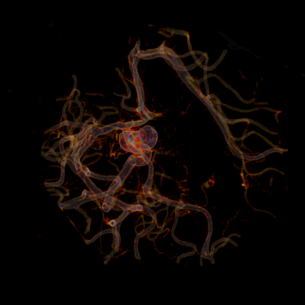

# Hydrant

* voxel dataset vis toolkit
* supports both **cuda** / **multi-thread** backends
* multi vis channels
* supports both **openh264** / **nvcodec** codec
* json configurable

## Requirements

* Git
* C++ >= 14
* CMake >= 3.0
* Cuda >= 10.0
* OpenH264 *(optional)*

## Aneurism Dataset Vis

### Configuration

```json
{
    "camera": {
        "orbit": {
            "arm": [ 25, 65, 2.2 ]
        }
    },
    "render": {
        "resolution": [ 512, 512 ],
        "renderer": "Volume",
        "params": {
            "mode": "Volume",
            "density": 1e-2,
            "transfer_fn": {
                "values": [
                    [ 0, 0, 0, 0 ],
                    [ 1, 0, 0, 1 ],
                    [ 1, 0.5, 0, 1 ],
                    [ 1, 1, 0, 1 ],
                    [ 0, 1, 0, 1 ],
                    [ 0, 1, 1, 1 ],
                    [ 0, 0, 1, 1 ],
                    [ 1, 0, 1, 1 ],
                    [ 0, 0, 0, 0 ]
                ]
            }
        }
    }
}
```

### Unoptimized Performance

* Tesla P4 (x1) = `49.656(ms)`
  * Decode = `36(ms)`
  * Render = `13(ms)`

### Volume



### Blocks.Volume


### Blocks.Solid


